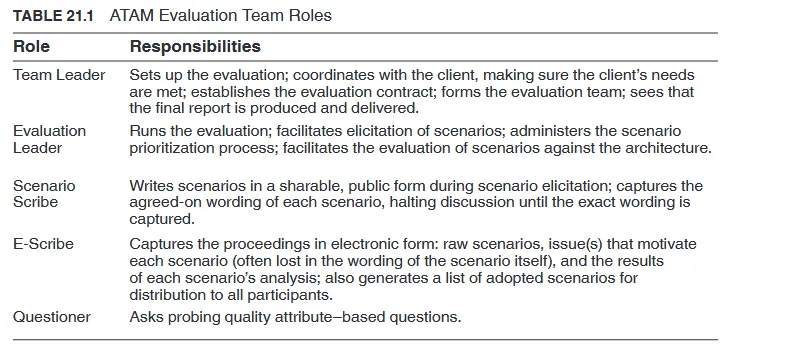

# Chapter 21 - Evaluating an Architecture

## Evaluation as a Risk Reduction Activity

Every architecture comes with risks. The output of an architecture evaluation includes an identification of risky portions of the architecture.

- The estimated cost of a risk is the probability of that event occurring multiplied by the cost of the impact.
- Once the risks have been identified, then fixing them is, like the evaluation itself, a cost/benefit issue.

Evaluations can be done throughout the development process at different phases, with
different evaluators, and with differences in how the evaluation is performed.

## What are Key Evaluation Activities

An evaluation is based on architectural drivers—primarily architecturally significant requirements (ASRs) expressed as quality attribute scenarios.

Every evaluation should include (at least) these steps:

1. The reviewers individually ensure that they understand the current state of the architecture.
    1. Documentation that shared through a presentation by the architect.
2. The reviewers determine a number of drivers to guide the review.
3. For each scenario, each reviewer should determine whether the scenario is satisfied.
    1. Time constraints play a role in determining how long this step is allowed to continue.
4. The reviewers capture potential problems exposed during the prior step.

---

How much analysis should you do? Decisions made to achieve one of the driving architectural requirements should be subject to more analysis than others, because they will shape critical portions of the architecture.

Some specific considerations include these:

- The importance of the decision. (more care if it important)
- The number of potential alternatives. (more time spent evaluating them)
- Good enough as opposed to perfect. (Many times, two possible alternatives do not differ dramatically in their consequences)

## Who can Perform the Evaluation

Evaluators should be highly skilled in the domain and the various quality attributes for which the system is to be evaluated. Excellent organizational and facilitation skills are also a must for evaluators

- Evaluation by the Architect (explicitly or implicitly every time the architect makes a key decision)
- Evaluation by Peer Review (just like code, but there should a fixed amount of time allocated for this)
- Evaluation by Outsiders (they might be able to cast a more objective eye)

## Contextual Factors

For peer reviews or outside analysis, a number of contextual factors must be considered when
setting up an evaluation:

1. What artifacts are available?
2. Who sees the results? (some results are more private)
3. Which stakeholders will participate?
4. What are the business goals? (whether system will satisfy business goals, they should be captured/prioritized before evaluation, else be done in the evaluation itself)

## The Architecture Trade-off Analysis Method

> The Architecture Trade-off Analysis Method (ATAM) is the process we have formalized to perform architecture evaluations.
> 

The ATAM is designed so that evaluators do not need prior familiarity with the architecture or its business goals, and the system need not be constructed yet.

### Participants

*Mutual cooperation of three groups*

- The evaluation team (external to the project whose architecture is being evaluated)
- Project decision makers (these people are empowered to speak for the development project or have the authority to mandate changes to it)
- Architecture stakeholders (stakeholders have a vested interest in the architecture performing as advertised)

### Outputs

1. A concise presentation of the architecture
2. Articulation of the business goals
3. Prioritized quality attribute requirements expressed as quality attribute scenarios
4. A set of risks and non-risks
5. A set of risk themes (overarching theme that identify systemic weakness)
6. Mapping of architectural decisions to quality requirements
7. A set of identified sensitivity points and trade-off points. 

The outputs of the ATAM exercise can be used to build a final report that recaps the method, summarizes the proceedings, captures the scenarios and their analysis, and catalogue the
findings.

### Phases

*Four phases*

- Phase 0: Parternership and Preperation (the evaluation team leadership and the key project decision makers work out the details of the exercise)
- Phase 1 & 2: Evaluation (everyone gets down to the business of analysis)
- Phase 3: Follow-up (the evaluation team produces and delivers its final report)

### Steps of Evaluation Phase

1. Present the ATAM
2. Present the Business Goals
3. Present the Architecture
4. Identify the Architectural Approaches
5. Generate a Quality Attribute Utility Tree
6. Analyse the Architectural Approach

*Hiatus and Start of Phase 2* (team summarized what it has learns and interacts informally with architect in this hiatus)

1. Brainstorm and Prioritize Scenarios
2. Analyse the Architectural Approaches
3. Present the Results

## Lightweight Architecture Evaluation

The Lightweight Architecture Evaluation (LAE) method is intended to be used in a project-internal context where the reviewing is carried out by peers on a regular basis. 

- The duration of an LAE exercise depends on the number of quality attribute scenarios generated and examined, which is in turn based on the scope of the review.
    - Thus an LAE exercise can be as short as a couple of hours or as long as a full day. It is carried out entirely by members internal to the organization.

# Architectural Software Quality Assurance

## Introduction

One particular task that rests heavily on a software architect’s shoulder is architectural quality assessment, prioritization, and conformance checking.

- It is well established that different architectural qualities often compete, the classic trade-off between performance and maintainability being one example

There are many architectural quality frameworks and evaluation techniques.  However, most of these techniques are characterized by being rather heavyweight and costly to perform (e.g. scenario-based techniques such as the Architecture Trade-off Analysis Method (ATAM)-

- Thus less optimal for software architects to apply continuously in agile development.

The architectural Software Quality Assurance technique (aSQA), has been developed by software architects in Systematic A/S as a lightweight technique for continuous quality assessment and prioritizing in software architecture and development work.

## The aSQA Technique

Systematic combines CMMI with the Scrum method for agile development of its software systems. Scrum is inherently a feature-oriented method focusing on adding user-oriented functionality in each iteration (or “sprint”) for the customer to evaluate.

- Nevertheless, the quality of the software architecture is essential in the products of Systematic in order to support both customer-dictated quality requirements (typically performance and reliability) as well as more engineering related quality requirements (such as maintainability).

The aSQA evolved as a software architect’s technique to support an architectural focus even in the face of a feature-oriented process.

- A central requirement of the technique was therefore that it should allow continuous quality assessment. It should be lightweight meaning efficient to perform in terms of spent person hours for the software architect as well as central stakeholders of the project.
- Another requirement was that it should allow software architecture quality attributes to be quantified.
- The third and final requirement was that aSQA should allow software architecture quality attributes to be prioritized.

### The aSQA Steps

- Step 1: A central aspect of aSQA is to get stakeholders to agree on which software architecture quality attributes to consider for the project as well as agree on what they mean
- Step 2: A crucial step in aSQA is to define a mapping of quality measurements to aSQA levels.
    - In aSQA an ordinal scale of values ranging from 1 to 5 (a reference interval scale) is used ubiquitously to measure all quality attributes as this allows a coarse and manageable comparison of values across quality attributes:
        - 1: Unacceptable: Important stakeholders find the system unacceptable because of the value of the quality attribute in question.
        - 3: Acceptable: No relevant stakeholder finds the system unacceptable because of the value of the quality attribute in question.
        - 5: Excellent: All relevant stakeholders are highly satisfied by the value of the quality attribute in question
- Step 3: A prerequisite for using the evaluation part of aSQA is the existence of (a design of) components for a software system
- Step 4: The evaluation step involves assessing target and current aSQA levels for all components for all considered quality attributes and results in a table that highlight architectural issues that require attention by the software architects.
    - In Step 4.1 a target level is set for each component.
    - In Step 4.2 the current quality level is measured/assessed (using the criteria set up in Step 2)
    - Step 4.3 is a computation step as the current health is calculated using the following formula:
        
        $health = 5 − max(0, (target − current))$
        
        - This formula assigns health from 1 to 5 with 5 being excellent health, i.e. the target level has been achieved.
    - In Step 4.4 the importance levels are defined i.e. stakeholders’ assessment of which quality attributes of which components should be prioritized
    - The last step is Step 4.5 that again is a pure computation step that combines health and importance to determine the focus level of each quality attribute of each component. The focus level is calculated as:
        
        $focus = ceil((6 − health) × importance/5)$
        
        - Thus the lower the health level is and the more higher the importance level is, the higher the focus level will be.
- Step 5: The analysis step is basically to overview the table, and based on that define initiatives to improve quality.
- In Step 6, these initiatives will typically lead to items being added to the product backlog and planning these for later sprints.
- Step 7 is the improving step which is the concrete work by the team to increase the quality attributes in the particular components.

