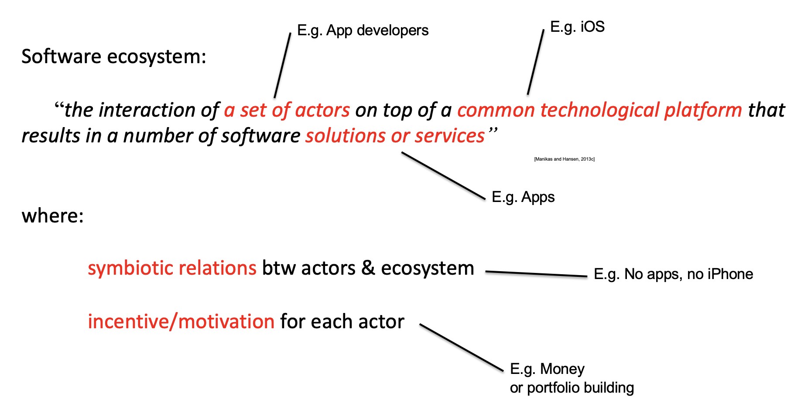
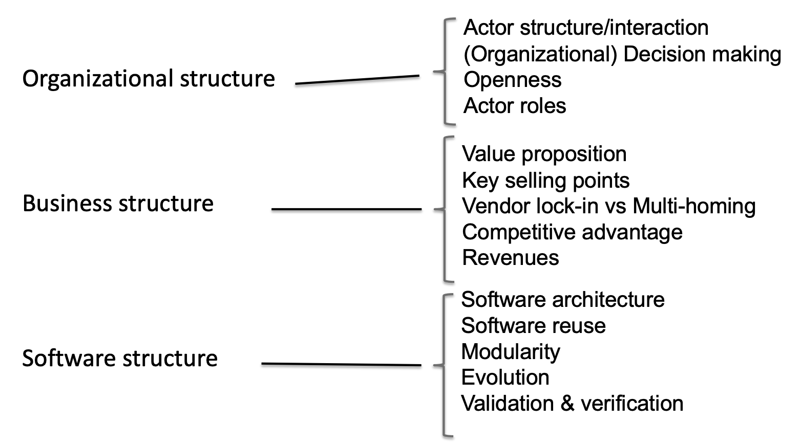
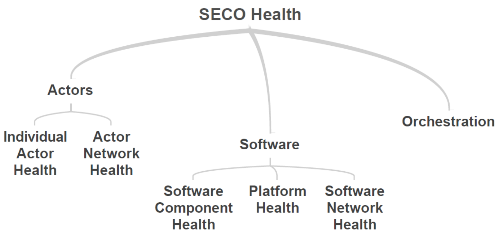

# Lecture 8 - Software ecosystems

## Software ecosystems
> **Definition**: The interaction of a set of actors on top of a common technological platform that results in a number of software solutions or services.

> Where:
>* symbiotic relations btw actors & ecosystem
>* incentive/motivation for each actor

> Characteristics:
>* Common infrastructure (technology/platform)
>* Set of actors/community
>* Business models/incentives

### IOS example

## Elements of a (Successful) Ecosystem
>* Software interaction
>* Actor involvement & interaction
>* Actor incentive (value creation)
>* Survival (prosperity) depends on the survival of the ecosystem as a whole

> To architect is the art of **predicting** the future
> Need to predict how the environment is going to evolve around your system and
anticipate changes.

## Software ecosystem analysis
> Software architecture is:
>  The software architecture of a computing system is the structures of the system, which comprise software elements, the externally visible properties of those elements, and the relationships among them.

>Then the software ecosystem architecture is:
> The architecture of a software ecosystem is the set of structures needed to reason about the software ecosystem, which comprise actor and software elements, relations among them, and their properties.

### Software ecosystems can analyzed using 3 structures:
* Organizational structures
* Business structures
* Software structures

> **Organizational structures**:
> * **Elements**: Applications, platform, users, developers, development projects, plans.
> * **Relations**: Governed by, developed by, maintained by, connected to.
> * **Models**: Organizational structure, organization relationship & interactions, organization roles.

> **Business structures**:
> * **Elements**: Products, services, partners, customers, resources. 
> * **Relations**: Channels, customer relationship, revenue stream.
> * **Models**: Business model canvas

> **Software structure**:
> * **Elements**: Modules, functions, services, nodes, developers.
> * **Relations**: Depends on, used by, deployed on, developed by.
> * **Models**: Software architecture description.

## Software ecosystem health
> **Definition**: The ability of the ecosystem to endure and remain variable and productive over time.

### Software ecosystem health - measurement
> Three aspects
>* **Productivity**: Ability of the ecosystem to continuously provide value
>* **Robustness**: Ability to sustain perturbations
>* **Niche creation**: Ability to constantly produce more than “commodities”

> Actor roles (from their influence to the ecosystem):
>* **Keystone**: Provides value to the surrounding actors and promotes the ecosystem health
>* **Dominator**: “Consumes” value from surrounding actors and thus damages ecosystem health
>* **Niche creator** Adds value to the ecosystem and supports ecosystem health

## Summary
> Many software systems cannot be studied isolation

> When analyzing software systems many times additional perspectives that only software should be evaluated

> Software ecosystems can be analyzed using three structures:
> * Organizational, business, and software

> The health of software ecosystem indicates the probability of the ecosystem to continue existing in the future

>Ecosystem health depends on the software and actor interaction as much as the orchestration of the ecosystem